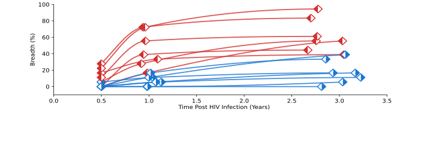

# cfHIV  
### Integrated cfRNA/cfDNA analysis of HIV, host transcriptome, and microbiome correlates of broadly neutralizing antibody development

---
## Overview

This repository contains the complete computational analysis pipeline used to study host, viral, and microbial correlates of broadly neutralizing antibody (bNAb) development in people living with HIV (PLWH) using plasma cell-free nucleic acids.

The pipeline integrates:

- Plasma **cell-free RNA (cfRNA)** sequencing
- Plasma **cell-free DNA (cfDNA)** sequencing
- Host transcriptome profiling
- HIV consensus genome reconstruction
- Microbiome and virome characterization
- Differential abundance analysis
- Pseudotime modeling of neutralization breadth
- GB virus C (GBV-C) enrichment analysis
- Phylogenetic inference of viral evolution

This repository contains:

- Analysis notebooks used to generate all manuscript figures
- Processed tables used for downstream statistical analysis
- HIV phylogenetic outputs
- Conda environments for reproducibility
- Final exported figures (main + supplementary)

---

# Study Summary

We analyzed 42 longitudinal plasma samples from 14 participants in the CAPRISA cohort:

- 7 individuals who developed broadly neutralizing antibodies (bNAb producers)
- 7 matched controls who did not

Samples were collected approximately:

- 6 months post infection
- 1 year post infection
- 3 years post infection

The pipeline enables simultaneous recovery of:

- Host immune transcriptomic signatures
- HIV viral genotypes from cfRNA
- Viral co-infections such as GBV-C

Key findings supported by this codebase include:

- Early immune activation signature in bNAb producers
- Enrichment of MHC class I antigen presentation genes
- Independence from viral load and CD4 counts
- Successful HIV consensus genome reconstruction from cfRNA
- Microbiome differences between groups
- Enrichment of GBV-C in individuals who develop breadth

---

